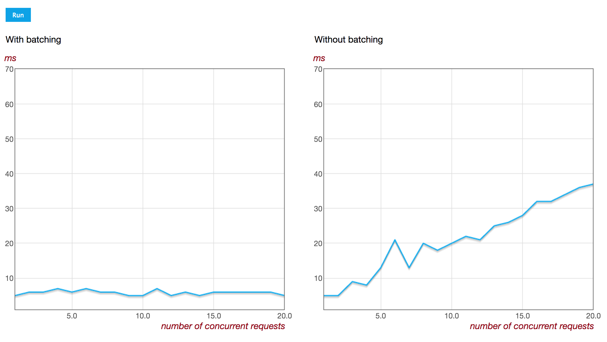

# bla-benchmark
The benchmark illustrates how `batch mode` works in [bla](https://github.com/baby-loris/bla) library.

In a word, in `batch mode` concurrent requests are collected within a short period of time and sent as a single request.



### Quick start
Clone this repository and run:
```
npm install
npm start
```

Follow the link:
```
http://localhost:8081
```

Don't forget to click the `run` button. :)

### Credits
Thanks to [Flotr2](https://github.com/HumbleSoftware/Flotr2) for nice diagrams.
